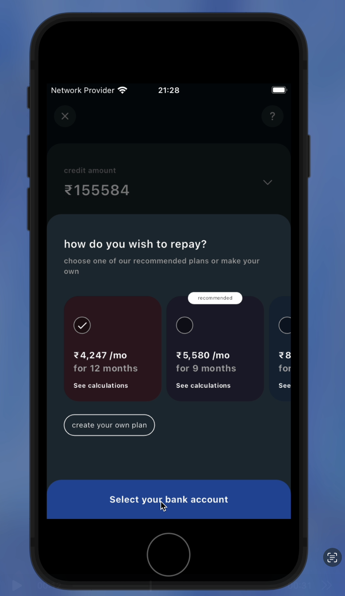

# CRED-STACK

## Description

CRED-STACK is a Flutter project following the MVC architecture. It provides a structured approach to app development by separating concerns into Models, Views, and Controllers.

## Architecture

```
apk
   - app-release.apk
assets
   - asset files (images)
lib
   - constants
       - constant.dart
   - controller
       - controller.dart
   - models
       - model.dart
   - services
       - service.dart
   - utils
       - util.dart
   - views
       - view.dart
   - main.dart
```

## 📸 Screenshots and Recordings

<video width="320" height="240" controls>
  <source src="assets/screenRecording/app-screen-recording.mp4" type="video/mp4">
  Your browser does not support the video tag.
</video>

### Stack 1


### Stack 2



### Stack 3


## 📲 APK Download

You can download the APK file for the app from the following location:

[Download the app-release.apk](apk/app-release.apk)

### Installation Instructions:

1. Download the APK file using the link above.
2. Transfer the `.apk` file to your Android device.
3. On your device, go to **Settings** > **Security** and enable **Install from Unknown Sources**.
4. Open the APK file on your device to install the app.

## Dependencies

The project uses the following dependencies:

- **flutter:** SDK for building UI applications
- **cupertino_icons:** iOS-style icons
- **dio:** HTTP client for API requests
- **provider:** State management solution
- **lottie:** Animated assets
- **fluttertoast:** Toast notifications
- **sleek_circular_slider:** Circular slider for UI

## Getting Started

### Prerequisites

Ensure you have Flutter installed. You can check by running:

```sh
flutter --version
```

### Installation

1. Clone the repository:
   ```sh
   git clone <repo_url>
   ```
2. Navigate to the project directory:
   ```sh
   cd cred-stack
   ```
3. Install dependencies:
   ```sh
   flutter pub get
   ```

### Running the Project

To run the application, execute:

```sh
flutter run
```

## Features

- Follows MVC architecture for clean code organization
- Uses Dio for efficient API handling
- Includes Provider for state management
- Supports animated assets with Lottie
